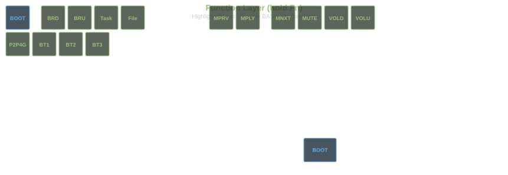

# cheycron's QMK Firmware for Keychron V3 Max

Personal fork of the [QMK firmware](https://github.com/qmk/qmk_firmware) for the **Keychron V3 Max** keyboard with encoder.

The custom keymap lives at `keyboards/keychron/v3_max/ansi_encoder/keymaps/cheycron/` and is split into four layers: productivity base, function, gaming, and numpad/mouse.

## How to Build

Compile from the QMK root with:

```bash
make keychron/v3_max/ansi_encoder:cheycron
```

Flash the resulting `.bin` with [QMK Toolbox](https://github.com/qmk/qmk_toolbox).

## Keymap Overview

### 1. Base Layer


- Standard ANSI TKL typing layout.
- `Fn` is a momentary layer switch to `BASE_FN`.
- Top-right keys toggle `GAMING` and `NUM_PAD`.
- Caps Word is enabled with **both shifts**; it is ideal for acronyms and code identifiers.

### 2. Function Layer (`BASE_FN`)



- Hold `Fn` to access it.
- RGB: `RGB_MATRIX_SPLASH`.
- Focused on media, lighting, system shortcuts, and wireless control.
- `Fn` + `Esc` enters the bootloader/flash mode directly.
- Highlighted groups:
  - **Green:** Task View / File Explorer / brightness shortcuts.
  - **Goldenrod:** media controls.
  - **Gold:** volume controls.
  - **Blue:** Bluetooth host switching (`BT_HST1..3`) and `P2P4G`.
- `QK_BOOT` is exposed here for direct bootloader access.

### 3. Gaming Layer


- Toggle with `1+2+3`.
- RGB: `RGB_MATRIX_TYPING_HEATMAP`.
- `Windows`/`Command` keys are removed in this layer.
- `A`/`D` are handled with SOCD cleanup so only one direction is active at a time.
- `Q+W+E` toggles **auto-run forward**: it keeps `W` held until `W` or `S` is pressed again, or until the combo is toggled off.
- Visual feedback for auto-run follows a gamer purple theme: `A/S/D` stay magenta and `W` pulses blue/magenta like an upward arrow.

### 4. Numpad Layer


- Toggle with `TG(NUM_PAD)`.
- RGB: `RGB_MATRIX_SPLASH`.
- Converts the right side into a numpad.
- Adds mouse keys for pointer movement and clicks.

## Rotary Encoder

The encoder rotates volume up/down on every layer. There is no layer-specific encoder mode in this keymap.

## Typing Helpers

### Caps Word

- Trigger: **both Shift keys pressed together**.
- Stops automatically on word-breaking keys.
- `COMMAND_ENABLE` is disabled in this keymap so `Shift+Shift` can be reserved for Caps Word.

## Key Combos


This diagram documents the shared/base combos only. Gaming-only behavior is shown in `gaming.svg`.

| Layer         | Keys            | Action                                             | Shortcut             |
| :------------ | :-------------- | :------------------------------------------------- | :------------------- |
| `BASE`        | `Z` + `X`       | Undo                                               | `Ctrl` + `Z`         |
| `BASE`        | `Z` + `X` + `C` | Redo                                               | `Ctrl` + `Y`         |
| `BASE`        | `X` + `C`       | Cut                                                | `Ctrl` + `X`         |
| `BASE`        | `C` + `V`       | Copy                                               | `Ctrl` + `C`         |
| `BASE`        | `V` + `B`       | Paste                                              | `Ctrl` + `V`         |
| `BASE`        | `S` + `D`       | Save                                               | `Ctrl` + `S`         |
| `BASE`        | `.` + `/`       | Comment line                                       | `Ctrl` + `/`         |
| `BASE/GAMING` | `1` + `2` + `3` | Toggle gaming layer                                | `TG(GAMING)`         |
| `BASE`        | `F3` + `F4`     | [SuperF4](https://stefansundin.github.io/superf4/) | `Ctrl` + `Alt` + `F4` |

## SVG Legend

- `keyboard.svg`: base layout overview.
- `function.svg`: Fn-held layer overlay with the main `BASE_FN` shortcuts.
- `gaming.svg`: gaming layer details, including SOCD movement and auto-run.
- `numpad.svg`: numpad/mouse layer.
- `combos.svg`: shared combos and general layer toggles.
