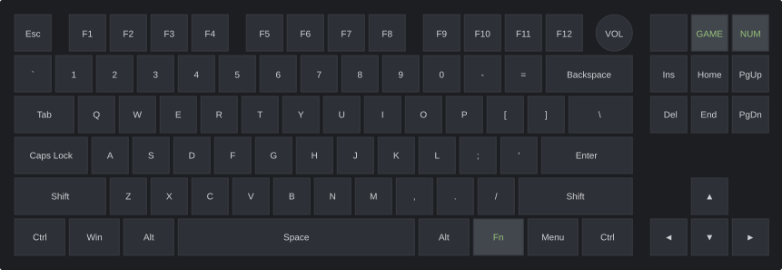
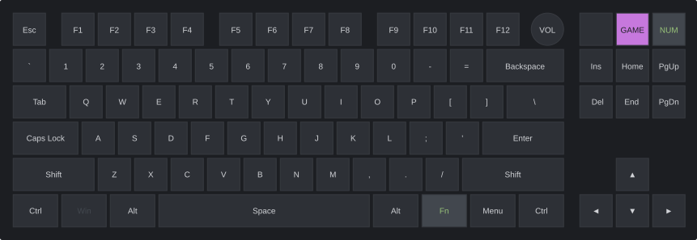
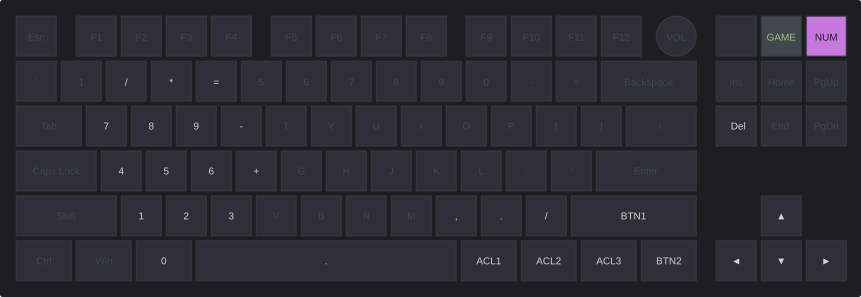
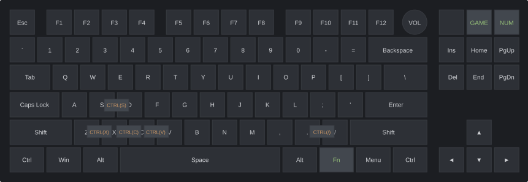

# cheycron's QMK Firmware for Keychron V3 Max

This is a personalized fork of the [QMK firmware](https://github.com/qmk/qmk_firmware), specifically configured for the **Keychron V3 Max** keyboard (TKL ANSI w/ Encoder).

The keymap, located at `keyboards/keychron/v3_max/ansi_encoder/keymaps/cheycron/`, is designed to enhance productivity for both coding and general use, and includes a dedicated gaming mode.

## How to Build

To compile this firmware, use the following `make` command from the QMK root directory:

```bash
make keychron/v3_max/ansi_encoder:cheycron
```

Flash the resulting `.bin` file using the [QMK Toolbox](https://github.com/qmk/qmk_toolbox).

---

## Keymap Features

The functionality is split across four main layers, each with a distinct purpose and RGB lighting scheme to indicate the active layer.

### Layers

#### 1. Base Layer



-   **RGB Mode:** `RGB_MATRIX_DUAL_BEACON`
-   This is the standard QWERTY layout for everyday typing.
-   The `Fn` key (Right of Spacebar) provides momentary access to the `BASE_FN` layer.
-   Dedicated keys in the top-right cluster toggle the `GAMING` and `NUM_PAD` layers.

#### 2. Function Layer (`BASE_FN`)

-   **Access:** Hold the `Fn` key.
-   **RGB Mode:** `RGB_MATRIX_SPLASH` with custom key colors.
-   This layer provides access to media controls, lighting adjustments, and Bluetooth device switching.
-   **Highlighted Keys:**
    -   **Green:** System functions (Brightness, Task View, File Explorer).
    -   **Goldenrod:** Media controls (Previous, Play/Pause, Next).
    -   **Gold:** Volume controls.
    -   **Blue:** Bluetooth host switching (BT1, BT2, BT3).

#### 3. Gaming Layer



-   **Access:** Toggle with the `TG(GAMING)` key (top-right).
-   **RGB Mode:** `RGB_MATRIX_TYPING_HEATMAP`
-   This mode is optimized for gaming:
    -   The `Windows` / `Command` keys are disabled to prevent accidental presses.
    -   Includes an anti-ghosting feature for `A` and `D` keys: if you hold one key and press the other, the first one is unregistered to prevent conflicting inputs in games.
    -   Includes an auto-run toggle on `Q` + `W` + `E`: it holds `W` until `W` or `S` is pressed, or until the toggle is pressed again.
    -   While auto-run is active, the gaming RGB indicator switches to red so the state is visible at a glance.

#### 4. Numpad Layer



-   **Access:** Toggle with the `TG(NUM_PAD)` key (top-right).
-   **RGB Mode:** `RGB_MATRIX_SPLASH` with custom key colors.
-   This layer transforms the right side of the keyboard into a fully functional number pad.
-   It also includes basic mouse control keys.
-   **Highlighted Keys:**
    -   **Cyan/Blue:** Numpad keys.
    -   **White/Yellow:** Mouse movement and click keys.

### Rotary Encoder

The rotary encoder's function changes based on the active layer:

| Layer             | Clockwise        | Counter-Clockwise | Press |
| :---------------- | :--------------- | :---------------- | :---- |
| **Base**          | Volume Up        | Volume Down       | Mute  |
| **Function (FN)** | RGB Hue Increase | RGB Hue Decrease  | N/A   |
| **Gaming**        | Volume Up        | Volume Down       | Mute  |
| **Numpad**        | Volume Up        | Volume Down       | Mute  |

### Key Combos



To improve workflow speed, several key combinations are available across the keymap:

| Layer          | Keys            | Action                                             | Shortcut             |
| :------------- | :-------------- | :------------------------------------------------- | :------------------- |
| `BASE`         | `Z` + `X`       | Undo                                               | `Ctrl` + `Z`         |
| `BASE`         | `Z` + `X` + `C` | Redo                                               | `Ctrl` + `Y`         |
| `BASE`         | `X` + `C`       | Cut                                                | `Ctrl` + `X`         |
| `BASE`         | `C` + `V`       | Copy                                               | `Ctrl` + `C`         |
| `BASE`         | `V` + `B`       | Paste                                              | `Ctrl` + `V`         |
| `BASE`         | `S` + `D`       | Save                                               | `Ctrl` + `S`         |
| `BASE`         | `.` + `/`       | Comment Line                                       | `Ctrl` + `/`         |
| `BASE/GAMING`  | `1` + `2` + `3` | Toggle Gaming Layer                                | `Gaming Layer`       |
| `GAMING`       | `Q` + `W` + `E` | Auto Run Forward                                   | Hold `W`             |
| `BASE`         | `F3` + `F4`     | [SuperF4](https://stefansundin.github.io/superf4/) | `Ctrl` + `Alt` + `F4` |
